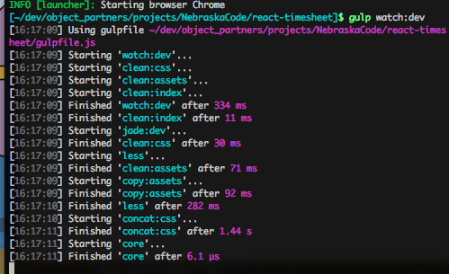
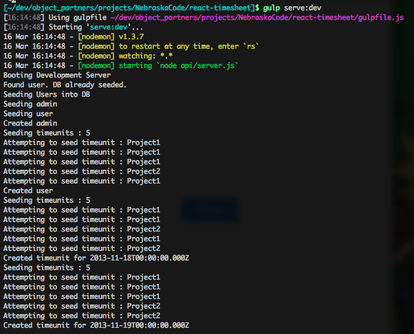
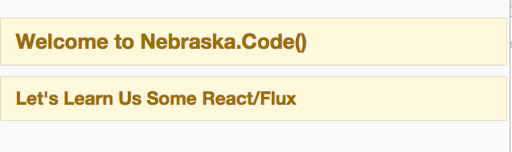

# Lab one - Setup and install dependencies

### Git and Node
#### Windows
* Install GitBash using the installer http://git-scm.com/downloads
* Install Node using the installer https://nodejs.org/download/
* Install Python 2.7.x using the installer https://www.python.org/downloads/
  * This is needed to build node native libraries  
* Install Microsoft Visual Studio using the installer https://www.visualstudio.com/downloads/download-visual-studio-vs
  * This is needed to build node native libraries 
* Restart
* Open a GitBash terminal

#### Mac
* Install Homebrew http://brew.sh (if you haven't already done so)
* In a terminal
  * brew install node

### Ensure all global dependencies have been installed

* [Gulp](http://gulpjs.com/) `npm install -g gulp`
* [Nodemon](https://github.com/remy/nodemon/) `npm install -g nodemon`

**NOTE:** If you have errors, try running this first:
```
npm config set strict-ssl false
```

### Checkout the Github repository

- Checkout project from Github

```
git clone https://github.com/objectpartners/react-timesheet.git
```

- You should get output similar to below:

```javascript
Cloning into 'react-workshop'...
remote: Counting objects: 3003, done.
remote: Compressing objects: 100% (1458/1458), done.
remote: Total 3003 (delta 1413), reused 2684 (delta 1256)
Receiving objects: 100% (3003/3003), 1.44 MiB | 1.15 MiB/s, done.
Resolving deltas: 100% (1413/1413), done.
Checking connectivity... done.
```

- Change directories to the lab main directory.

```
cd react-timesheet
```

- Now let's checkout the `lab-1-setup` branch.

```
git checkout lab-01-project-setup-start
```

### Install the application dependencies

- Install the NPM dependencies

```
npm install
```

### Start the Gulp build and watcher.

- Run the Gulp watcher for our Client src.

```
gulp watch:dev
```


> This is a long running process that watches for changes in your code and immediately kicks off a build.

### Run the application and view the start screen

- In a SEPARATE terminal window, run:

```
gulp serve:dev
```

- This kicks off a Node server and serves up our `index.html` page.

- This is also a long running process..it only ends on an error.



- Open your browser and navigate to http://localhost:3000.

- Verify that you see the welcome page.



##### Now let's check out our project's structure so we know what goes where.
