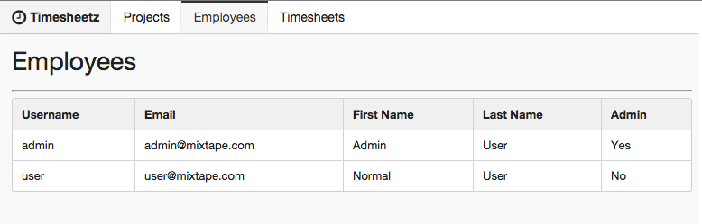

# Lab Three - Adding Routing and Components Composition

## Checkout the Lab Branch
- In a terminal:

```
git checkout lab-03-routing-start
git pull
```

If not running, start the `gulp watch:dev` and `gulp serve:dev` tasks.  Otherwise, restart the running tasks to pick up any changes in the lab-03-routing-start branch.

### Check it out!

- Before doing anything, let's look at the progress that has already been completed on the application by the rest of the team.
  - Peruse the **client/src/components** directory and notice that the **Projects** and **Timesheets** modules have been implemented by the team.
  - You will be building out the **Employees** module and adding a **Navbar** to the app to enable navigation.
  - The module files have been stubbed out for you, we just need to add the codez.

&nbsp;
## Creating our Application's Routes

- Open **client/src/routes.jsx**
- Let's start by importing the component classes that we're going to use as the **Handlers** for our routes:

```javascript
var App = require('./components/app');

var Projects = require('./components/projects/projects');
var Employees = require('./components/employees/employees');
var Timesheets = require('./components/timesheets/timesheets');
```

- Next let's configure our routes:
  - We need a container route `app` to contain our application skeleton.
  - We need separate sibling routes for **Projects**, **Employees**, and **Timesheets** that will populate the `<RouteHandler />` inside the **App** component.
  - Even though **Timesheets** content is a sibling to **Employees**, we want the route to behave as if it is a child. That way, we'll have access to the `user_id` from the route's params.
  - If we can't match a route, we want to redirect the user to the **Employees** component.

> Note: You will notice below that we are exporting `JSX` which is wrapped in parens `()`, not curlies `{}`.

```javascript
module.exports = (
  <Route name='app' path="/" handler={App}>

    <Route name='projects'   path='/projects'  handler={Projects} />
    <Route name='employees'  path='/employees' handler={Employees} />
    <Route name='timesheets' path='/employees/:user_id/timesheets' handler={Timesheets} />

    <Redirect to="employees" />
  </Route>
);
```

&nbsp;
## Add the Navbar to our Application

- Open **client/src/components/common/navigation/navbar.jsx**

- We first need to mixin the extra functionality that we want our component to have. We do this by adding an array of our mixins to the **mixins** property on the React class:
  - **Router.State** gives us the `getRoutes()` method which we'll use to set the active class on the correct navbar link.

- Add the mixins to the **Navbar** component definition:  

```javascript
  mixins: [
    Router.State
  ],
```
- Now we can implement our `render()` method:
  - We first do a little lodash gymnastics to determine if the current route matches any of the routes registered in **routes.js**.
    - If there is a match, we add the **active** class to the corresponding **Link**.

  - We use **react-router**'s **Link** component to attach our navbar's buttons to the router's routes.
    - Notice the Timesheet's Link.  We are adding an extra prop, **params** so that the user's ID is reflected in the application's url.


```javascript
render : function () {
  var activeRoutes = _.pluck(this.getRoutes(), 'name').join('.').split('.');

  var projectsClasses = classNames('item', {
    active: _.contains(activeRoutes, 'projects')
  });

  var employeesClasses = classNames('item', {
    active: _.contains(activeRoutes, 'employees')
  });

  var timesheetsClasses = classNames('item', {
    active: _.contains(activeRoutes, 'timesheets')
  });

  return (
    <div className="ui fixed menu fluid">
      <a className="header item" href="#">
        <i className="fa fa-clock-o fa-lg"/> {this.state.title}
      </a>

      <Link className={projectsClasses} to="projects">Projects</Link>
      <Link className={employeesClasses} to="employees">Employees</Link>
      <Link className={timesheetsClasses} to="timesheets" params={{user_id: this.state.user._id}}>Timesheets</Link>

    </div>
  );
}
```

- Now, all we need do is to set up the initial state to be used within the `render()` method we just implemented:

```javascript
getInitialState: function () {
  return {
    title: 'Timesheetz',
    user: {_id: 'all'}
  };
},
```

&nbsp;
## Test the Navbar

- Just like in lab 2, we need to test that our component will render without errors.
- Open **client/src/components/common/navigation/navbar.spec.js** and add the test suite.

&nbsp;
#### What's different?
  - You'll notice that we are using **proxyquire** to mock our our component imports for **react-router**. This is because we don't want the router to actually change the browser url during our tests.
  - We are also using a very simple `mockComponent()` that you can find in **src/components/mock.jsx**. This mock component just returns a plain `div`.
  - Finally, we are using **sinon** to stub the `getRoutes()` method so that we can control what it returns and track when it has been called.

- Add the below code to the **navbar.spec.js**

```javascript
beforeEach(function () {
  React = require('react/addons');
  TestUtils = React.addons.TestUtils;
});

beforeEach(function () {
  proxies = {
    'react-router': {
      RouteHandler: mockComponent('RouteHandler'),
      Link: mockComponent('Link'),
      State: {
        getRoutes: sinon.stub().returns([{name: 'projects'}])
      }
    },
    '@noCallThru': true
  };

  Navbar = proxyquire('./navbar', proxies);
  element = TestUtils.renderIntoDocument(<Navbar />);
});

it('should instantiate the Navbar', function () {
  expect(TestUtils.isCompositeComponent(element)).to.be.true;
});
```

&nbsp;
## Run the tests

- Run `gulp test` and verify that all the tests pass.
  - Since the rest of your team has already implemented a bunch of tests, you may have to do a little searching to find the tests you just wrote.

&nbsp;
## Test that the active class gets set on the correct Link

- Now that we've verified that the component can be compiled, let's test that the `active` class gets set on the appropriate `Link`.
- Add the test below under the previous test.

> Note: With Mocha (and other test suites) you can nest **describe** blocks within each other to make your test descriptions more specific.

```javascript
describe('when navigating between routes', function () {
  it('should set the appropriate active class', function () {

    // find all of the Links that are rendered inside of the element
    var Links = TestUtils.scryRenderedComponentsWithType(element, proxies['react-router'].Link);

    // find the item with the active class
    var projectLink = TestUtils.findRenderedDOMComponentWithClass(element, 'active');

    // make sure that it is the projects link
    expect(projectLink.getDOMNode().innerText).to.equal('Projects');
  });
});
```

- Run the tests. Did your new one pass?
- Note that we use the `getDOMNode()` method on the component to get its vanilla DOM object from the browser.

> Yeah, I know. We didn't even use the line of code that found all of the **Links** rendered within **element**, but I thought it would be cool to demonstrate that method. Try adding a breakpoint and stepping through your test in Chrome Dev Tools and inspect each object.

&nbsp;
## Implement the Application's container

- Now that we have our routes configured and a navbar that triggers those routes, we need a container for the navbar and an entry point for the route handlers.

- Open **client/src/components/app.jsx**
- Implement the `render()` method:

```javascript
render : function () {
  return (
    <div>
      <NavBar />
      <div className="container">
        <SectionHeader />
        <div className="row">
          <RouteHandler />
        </div>
      </div>
    </div>
  );
}
```

- Open **client/src/components/app.spec.js**
- Now, test the render method:

```javascript
beforeEach(function () {
  React = require('react/addons');
  TestUtils = React.addons.TestUtils;
});

beforeEach(function () {
  proxies = {
    './common/navigation/navbar': mockComponent('Navbar'),
    './common/section': mockComponent('SectionHeader'),
    'react-router': {
      RouteHandler: mockComponent('RouteHandler')
    }
  };

  App = proxyquire('./app', proxies);
  element = TestUtils.renderIntoDocument(<App />);
});

it('should instantiate the App', function () {
  expect(TestUtils.isCompositeComponent(element)).to.be.true;
});
```

- Run the tests. Did your new one pass?

&nbsp;
## Bootstrap the Router

- Now all we have to do is wrap our `React.render()` method within the callback for the `Router.run()` method. This will boostrap the application and hand control over to the **React Router**.
- Open our application entry point: **client/src/main.jsx**
- Add the following:

```javascript
Router.run(routes, function (Handler) {
  React.render(<Handler />, document.getElementById('app'));
});
```

&nbsp;
## Run the application and see your work.

If you haven't already done so,
- In a terminal window run: `gulp watch:dev` to fire off the build.
- In a separate terminal run: `gulp serve:dev` to serve the index.html.
- Navigate to [http://localhost:3000](http://localhost:3000) in your favorite browser.
- You should be able to click around the navbar and see the routes change.
  - I'm sure it worked fine for **Timesheets** and **Projects**, but we still need to implement **Employees**.

&nbsp;
## Composing React Components

- Now that we have functional routing between our three sections of the application, we need to finish the **Employee** module.

- We want to display the list of employees when the user clicks the employee link in the navbar.
- To do this, we need to build three components:
  - The *Employees* route handler that acts as our controller component.
  - The *EmployeeTable* component to contain our list of employees.
  - The *EmployeeRow* component that is repeated within our *EmployeeTable* component for each employee.

&nbsp;
## Create the EmployeeRow Component

- Open **client/src/components/employees/employee.row.jsx**
- We need to create a component that accepts an employee property (which is an object).
- We will expose a reference (ref) to the row via that employee's `_id` property.
- The row should contain `<td/>`'s for each of the employee's properties.
- Add the following to your EmployeeRow React class

```javascript
mixins: [
  Router.Navigation,
  Router.State
],

propTypes: {
  employee: React.PropTypes.object
},

render: function () {
  var employee = this.props.employee;

  var rowClasses = classNames('repeated-item fadeable-row', {
    'faded': employee.deleted
  });

  return (
    <tr className={rowClasses} ref={employee._id}>
      <td>{employee.username}</td>
      <td>{employee.email}</td>
      <td>{employee.firstName}</td>
      <td>{employee.lastName}</td>
      <td>{employee.admin ? 'Yes' : 'No'}</td>
    </tr>
  );
}
```

- Now, we need to test that our component renders correctly.
- Open **client/src/components/employees/employee.row.spec.js** and add the tests below.
  - Feel free to add actual properties to the employee object and test for their existence in a `<td/>`.

```javascript
beforeEach(function () {
  React = require('react/addons');
  TestUtils = React.addons.TestUtils;
});

beforeEach(function () {
  EmployeeRow = require('./employee.row');
});

it('should instantiate the EmployeeRow', function () {
  element = TestUtils.renderIntoDocument(<EmployeeRow employee={{_id: 1}} />);
  expect(TestUtils.isCompositeComponent(element)).to.be.true;
});
```

- Run the tests. Did your new one pass?

## Create the EmployeesTable Component

- Our next move is to create the table that will contain our **EmployeeRow**s.
- Open **client/src/components/employees/employee.table.jsx**

- We need to declare that the **employees** property should be an array of objects and that it is required.

```javascript
propTypes: {
  employees: React.PropTypes.arrayOf(React.PropTypes.object).isRequired
},
```

- Now we need to implement our `render()` method that:
  - Iterates through the list of employees and instantiates a new **EmployeeRow** for each employee.
  - Collect all the rows into a variable and add that variable to the table body.

> Remember JSX is just Javascript when it compiles so you can pass variables to other JSX elements so that it's included in our component's DOM.

- Add the render method below to the React class.

```javascript
render: function () {
  var key = 1;

  var employeeRows = this.props.employees.map(function (employee) {
    employee.id = key;

    return (
      <EmployeeRow employee={employee} key={++key} />
    );
  });

  return (
    <table className="ui celled table tsz-table-row-cursor">
      <thead>
        <tr>
          <th>Username</th>
          <th>Email</th>
          <th>First Name</th>
          <th>Last Name</th>
          <th>Admin</th>
        </tr>
      </thead>
      <tbody>
        {employeeRows}
      </tbody>
    </table>
  );
}
```

- Now let's test that our employee table renders correctly.
- Can you write a test to check the number of **EmployeeRows** added to our table?
- Open **components/employees/employee.table.spec.js**
- Add the following to the **Employee Table Component** suite:

```javascript
beforeEach(function () {
  React = require('react/addons');
  TestUtils = React.addons.TestUtils;
});

beforeEach(function () {
  employees = [{}, {}];

  EmployeeTable = require('./employee.table');
  element = TestUtils.renderIntoDocument(
    <EmployeeTable employees={employees} />
  );
});

it('should instantiate the EmployeeTable', function () {
  expect(TestUtils.isCompositeComponent(element)).to.be.true;
});
```

- Run the tests. Did your new one pass?

&nbsp;
## Create Employees Component

- Last, we need to add the table to our handler for the `/employees` route.
- Open **client/src/components/employees/employees.jsx**
- Add the render method below to the React class

> The component's `getInitialState()` has been implemented for you so that you'll have mock data.

```javascript
render: function () {
  return (
    <div>
      <div className="row">
        <EmployeeTable employees={this.state.pageConfig.data} />
      </div>
    </div>
  );
}
```

- Open **client/src/components/employees/employees.spec.js**
- Test that our component renders as expected.
- Add the code below to the **Employees Component** suite

```javascript
beforeEach(function () {
  React = require('react/addons');
  TestUtils = React.addons.TestUtils;
});

beforeEach(function () {
  Employees = require('./employees');
  element = TestUtils.renderIntoDocument(<Employees />);
});

it('should instantiate the Employees', function () {
  expect(TestUtils.isCompositeComponent(element)).to.be.true;
});
```

- Run the tests. Did your new one pass?

&nbsp;
## Run the application and see your work.

If you haven't already done so,
- In a terminal windows run: `gulp watch:dev` to fire off the build.
- In a separate terminal run: `gulp serve:dev` to serve the index.html.
- Navigate to [http://localhost:3000](http://localhost:3000) in your favorite browser.

- Click around and enjoy the result of your hard work during this lab.



&nbsp;
### Commit your changes to Git and get ready for the next lab.

```
git add .
git commit -m 'We added some routes'
```
