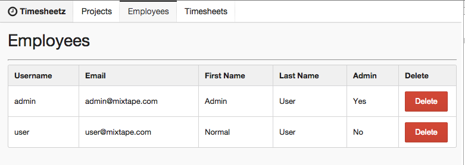
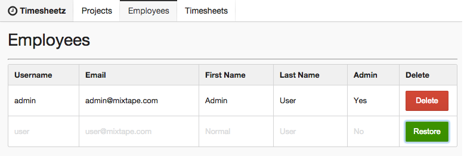

# Lab Four - Adding Flux to the Application

## Checkout the Lab Branch
- In a terminal:

```
git checkout lab-04-flux-start
git pull
```

If not running, start the `gulp watch:dev` and `gulp serve:dev` tasks.  Otherwise, restart the running tasks to pick up any changes in the lab-04-flux-start branch.

&nbsp;
### Check it out!

- Before doing anything, let's look at the progress that has already been completed on the application by the rest of the team.
  - Peruse the **client/src/components** directory and notice that the **Projects** and **Timesheets** modules have been implemented by the team.
  - Also look at the **Actions** and **Stores** directories to get a feel for how these classes are laid out and used.
  - Don't worry if it looks a little cryptic, by the end of this lab, you will understand what is happening.


- What will we do?
  - We will be building out the **Dispatcher** and **Store** Flux components.
  - We will use the **Store** Component to implement an **EmployeeStore** component.
  - We will then build our our **EmployeeActions** to communicate with the **EmployeeStore**.
  - Finally we will register our **Employees** controller component to listen for updates from our **EmployeeStore** and have our **EmployeeRow** notify the store of any changes.
  - The module files have been stubbed out for us, we just need to add the codez.

> The Flux pattern involves having the developer provide more boilerplate than other full-fledged frameworks like **Angular** or **Ember**.

&nbsp;
### Create the Flux Dispatcher

- Open **client/src/flux/flux.dispatcher.js**
- Most of the boilerplate has completed, you'll just need to implement `handleViewAction`:

```javascript
handleViewAction: function(action) {
  this.dispatch({
    source: 'VIEW_ACTION',
    action: action
  });
}
```

> This is the method that our **Actions** call when they are fired.

- Now let's test that this function does what we think it should:
- Open **client/src/flux/flux.dispatcher.spec.js** and add the suite below to the end of the Flux Dispatcher suite:

```javascript
describe('handling a view action', function () {
  it('should dispatch the action with a source of VIEW_ACTION', function () {
    dispatcher.handleViewAction('testAction');
    expect(spies.dispatch).to.have.been.calledWith({source: 'VIEW_ACTION', action: 'testAction'});
  });
});
```

- Make sure the test passes and move on to the next section.

&nbsp;
### Create the Flux Store

- Flux stores extend Node's **Event.Emitter** so that components can 'listen' for any events that the stores emit.
  - We emit events using the `emit()` method on the store.

- Open **client/src/flux/flux.store.js**.

- First, we need to create an object to hold our store's state as well as a getter and setter for the state.

```javascript
state: {},

getState: function () {
  return this.state;
},

setState: function (state) {
  this.state = _.extend(this.state, state);
},
```
- Next, we need to add methods that will add/remove change listeners as well as a method to emit the change event to our listeners.

```javascript
emitChange: function () {
  this.emit(CHANGE_EVENT);
},

addChangeListener: function(callback) {
  this.on(CHANGE_EVENT, callback);
},

removeChangeListener: function(callback) {
  this.removeListener(CHANGE_EVENT, callback);
},
```

- Finally we need a `register()` method that allows our stores to register **Actions** and callbacks with the store.
  - This method takes an object (events) that has the action types as keys and the respective callback as the value.
  - When the method is called, it registers a callback with the dispatcher which checks if there are any matching events.  If there are matches, it then calls the associated callback.
  - The callback must return a **Promise** so that when it resolves, `emitChange()` is called and all of the store's listeners can react accordingly.

```javascript
register: function (events) {
  var self = this;

  dispatcher.register(function (payload) {
    var action = payload.action;
    var promise = events[action.actionType];

    if (!_.isUndefined(promise)) {
      promise.apply(self, [payload])
        .then(function () {
          self.emitChange();
        });
    }
    return true;
  });
}
```

> That is really all the boilerplate needed to implement the Flux pattern. The rest of this lab will concentrate on extending the base store and pairing functionality with action types.

&nbsp;
### Create the Employee Actions

- Next, we need to define actions that can happen around an employee.
- For now, the actions are basic CRUD.
- Open **client/src/actions/employee.actions.js**


- An action definition consists of 2 main parts.
  - A constant representing the type.
  - A function to call which fires the action by telling the dispatcher to `handleViewAction()` and then sending it a payload which will be sent to listeners.


- First, let's define our constants:

```javascript
  LIST: 'LIST_EMPLOYEES',
  GET: 'GET_EMPLOYEE',
  CREATE: 'CREATE_EMPLOYEE',
  UPDATE: 'UPDATE_EMPLOYEE',
  DELETE: 'DELETE_EMPLOYEE',
  RESTORE: 'RESTORE_EMPLOYEE',
```

- Now we can implement the methods that notify the dispatcher to handle the view action.
  - One thing to note is that the Action's payload can be any valid Javascript object.  It could even contain callback functions.

- Add the following to **EmployeeActions**

```javascript
list: function (query) {
  dispatcher.handleViewAction({
    actionType: EmployeeActions.LIST,
    query: query
  });
},

get: function (id) {
  dispatcher.handleViewAction({
    actionType: EmployeeActions.GET,
    employee: {_id: id}
  });
},

create: function (employee) {
  dispatcher.handleViewAction({
    actionType: EmployeeActions.CREATE,
    employee: employee
  });
},

update: function (employee) {
  dispatcher.handleViewAction({
    actionType: EmployeeActions.UPDATE,
    employee: employee
  });
},

remove: function (employee) {
  dispatcher.handleViewAction({
    actionType: EmployeeActions.DELETE,
    employee: employee
  });
},

restore: function (employee) {
  dispatcher.handleViewAction({
    actionType: EmployeeActions.RESTORE,
    employee: employee
  });
}
```

&nbsp;
### Test the Employee Actions.

- Open **client/src/actions/employee.actions.spec.js** and add some simple tests to verify the action payloads.

```javascript
beforeEach(function () {
  React = require('react/addons');
  TestUtils = React.addons.TestUtils;
  _ = require('lodash');
  fluxDispatcher = require('../flux/flux.dispatcher');
});

beforeEach(function () {
  EmployeeActions = require('./employee.actions');

  dispatcher = sinon.stub(fluxDispatcher, 'handleViewAction', _.noop);
});

afterEach(function () {
  dispatcher.restore();
});

it('should instantiate the EmployeeActions', function () {
  expect(EmployeeActions).to.be.defined;
});

describe('firing a list action', function () {
  beforeEach(function () {
    query = "query";
    EmployeeActions.list(query);

    payload = {query: query, actionType: EmployeeActions.LIST};
  });

  it('should dispatch a view action with the query and a type of LIST', function () {
    expect(dispatcher).to.have.been.calledWith(payload);
  });
});

describe('firing a get action', function () {
  beforeEach(function () {
    id = "testId";
    EmployeeActions.get(id);

    payload = {employee: {_id: id}, actionType: EmployeeActions.GET};
  });

  it('should dispatch a view action with the id and a type of GET', function () {
    expect(dispatcher).to.have.been.calledWith(payload);
  });
});

describe('firing a create action', function () {
  beforeEach(function () {
    EmployeeActions.create(employee);

    payload = {employee: employee, actionType: EmployeeActions.CREATE};
  });

  it('should dispatch a view action with the employee and a type of LIST', function () {
    expect(dispatcher).to.have.been.calledWith(payload);
  });
});

describe('firing a update action', function () {
  beforeEach(function () {
    EmployeeActions.update(employee);

    payload = {employee: employee, actionType: EmployeeActions.UPDATE};
  });

  it('should dispatch a view action with the employee and a type of UPDATE', function () {
    expect(dispatcher).to.have.been.calledWith(payload);
  });
});

describe('firing a remove action', function () {
  beforeEach(function () {
    EmployeeActions.remove(employee);

    payload = {employee: employee, actionType: EmployeeActions.DELETE};
  });

  it('should dispatch a view action with the employee and a type of DELETE', function () {
    expect(dispatcher).to.have.been.calledWith(payload);
  });
});

describe('firing a restore action', function () {
  beforeEach(function () {
    EmployeeActions.restore(employee);

    payload = {employee: employee, actionType: EmployeeActions.RESTORE};
  });

  it('should dispatch a view action with the employee and a type of RESTORE', function () {
    expect(dispatcher).to.have.been.calledWith(payload);
  });
});
```

- Make sure the tests pass and move on to the next section.

&nbsp;
### Create the EmployeeStore

- Now, we get to create the store that will handle all of the business logic for our **Employees** components.
- Open **client/src/stores/employee.store.js**

- Our first task is to implement an `initialize()` method.  This method will register our store's actions with methods on the store and provide a default state.
  - We first create an events object and assign the respective callbacks on our store to the action type on the events object.
  - Once the events configuration has been created, we call the `register()` method on the base store. (see above)
  - Next, we set up the default state by using the `setState()` method.

```javascript
initialize: function () {
  var events = {};
  events[actions.LIST]    = this.list;
  events[actions.GET]     = this.get;
  events[actions.UPDATE]  = this.update;
  events[actions.DELETE]  = this.remove;
  events[actions.RESTORE] = this.restore;
  events[actions.CREATE]  = this.create;
  this.register(events);

  this.setState({
    employee: {},
    pageConfig: {
      data: [],
      totalItems: 0,
      limit: 5,
      page: 1
    }
  });

  return this;
},
```

- Create a helper method to compose the url for REST calls.

```javascript
url: function (employeeId) {
  var url = '/users';
  if (employeeId) {
    url += '/' + employeeId;
  }

  return url;
},
```

- Now, let's start talking to our server!!

- A quick side note: We will be using the awesome [axios](https://github.com/mzabriskie/axios) library to make our HTTP request/responses.

- First, let's implement a method to get a list of employees:
  - Note: the server is set up for pagination, so we need to send a pagination query and receive a page config object in the response.

```javascript
list: function (payload) {
  var self = this;

  return axios.get(this.url(), {params: payload.action.query})
    .then(function (res) {
      self.setState({pageConfig: res.data});
    })
    .catch(function (x) {
      console.log('Error attempting to retrieve employees.');
    });
},
```

> Notice that the method needs to return a **Promise** because that's how the base `register()` method will know to `emitChange()`.

- Now, let's implement the method to retrieve an individual employee and set it on the state:

```javascript
get: function (payload) {
  var self = this;

  return axios.get(this.url(payload.action.employee._id))
    .then(function (res) {
      self.setState({employee: res.data});
      return true;
    })
    .catch(function (data) {
      console.log('There was an error getting the employee');
    });
},

```

- Next, is our update method using an HTTP PUT request:

```javascript
update: function (payload) {
  var self = this;
  var employee = payload.action.employee;

  return axios.put(this.url(employee._id), employee)
    .then(function (res) {
      self.setState({employee: res.data});
      console.log('Employee : ' + employee.username + ', updated.');
    })
    .catch(function (x) {
      console.log('There was an error updating employee.');
    });
},

```

- Our DBA is extremely risk-intollerant, so we are not allowed to actually DELETE a record from the database. We are only allowed to set a deleted flag so the record can be restored easily. Our DBA has a periodic job that removes 'deleted' records and cleans up the data.

- So, instead of using an HTTP DELETE request, we set the deleted flag and perform an update:

```javascript
remove: function (payload) {
  var self = this;
  var employee = payload.action.employee;
  employee.deleted = true;

  return axios.put(this.url(employee._id), employee)
    .then(function (res) {
      self.setState({employee: res.data});
      console.log('Employee : ' + res.data.username + ', was deleted.');
      return true;
    })
    .catch(function (x) {
      console.log('Error attempting to delete employee.');
    });
},

restore: function (payload) {
  var self = this;
  var employee = payload.action.employee;
  employee.deleted = false;

  return axios.put(this.url(employee._id), employee)
    .then(function (res) {
      self.setState({employee: res.data});
      console.log('Employee : ' + res.data.username + ', was restored.');
      return true;
    })
    .catch(function (x) {
      console.log('Error attempting to restore employee.');
    });
},

```

- Our final method creates a new employee with an HTTP POST request:

```javascript
create: function (payload) {
  var self = this;

  return axios.post(this.url(), payload.action.employee)
    .then(function (res) {
      self.setState({employee: res.data});
      console.log('Employee : ' + res.data.username + ', created.');
    })
    .catch(function (x) {
      console.log('There was an error creating employee.');
    });
}
```
 - Now that we have completely set up the Flux architecture for **Employees** in our application, we just need to add hooks in our components to take advantage of it.

&nbsp;
### Add the Store and Actions to Employees

- Open **client/src/components/employees/employees.jsx**

- First things first, look inside the render method.  There are a couple of enhancements that have been made for you:
  - A **Pagination** component has been added for you to control pagination. Notice that it calls the `onPageChange()` callback.

- Next delete the stubbed methods between the TODO and ending comment.

- Now we can implement our **Employees** controller component to handle data interactions.

- Let's assign the **EmployeeStore** to the store property.

```javascript
store: EmployeeStore,
```

- We can also create a helper method to fire the `EmployeeActions.list` action:

```javascript
requestEmployees: EmployeeActions.list,
```

- Remember in previous labs that `getInitialState` was returning a default object? Now, we've completely handed that functionality over to the **EmployeeStore**.  All we have to do is return the store's state.

```javascript
getInitialState: function () {
  return this.store.getState();
},
```

- Now, we just need to hook up our component to its store by registering it as a listener for changes.
  - When the component is initially rendered to the DOM, we want to request the list of employees and listen for changes on the store.
  - When the store's state changes, we just need to update the component's state with the store's new state.
  - When the component is removed from the DOM, we want to stop listening for change events on the store.

```javascript
onChange: function () {
  this.setState(this.store.getState());
},

componentWillMount: function () {
  this.requestEmployees({page: 1});
  this.store.addChangeListener(this.onChange);
},

componentWillUnmount: function () {
  this.store.removeChangeListener(this.onChange);
},
```

- Finally, we need create the callback for when the **Paginator** emits a change event.
  - The event's payload will be the new page to load.  We just need to request that page of employees.

```javascript
onPageChange: function (page) {
  this.requestEmployees({page: page});
},
```

&nbsp;
## Run the application and see your work.

If you haven't already done so,
- In a terminal windows run: `gulp watch:dev` to fire off the build.
- In a separate terminal run: `gulp serve:dev` to serve the index.html.
- Navigate to [http://localhost:3000](http://localhost:3000) in your favorite browser.

- Click around and enjoy the result of your hard work during this lab.



- Try clicking on the Delete buttons to delete an employee. Doesn't work? Let's hook 'em up!!

&nbsp;
### Communicate with the EmployeeStore via EmployeeActions

- Open **client/src/components/employee.row.jsx**
- Uncomment the require statement for the **EmployeeActions**.
- Find the `TODO`s and add the appropriate Action calls to signal the **EmployeeStore** to take 'action'.

```javascript
EmployeeActions.remove(this.props.employee);
```

```javascript
EmployeeActions.restore(this.props.employee);
```

> This time, instead of creating a helper, we are calling the Action methods directly. Which do you like better?

- Now, let's test that they work.
- Open **client/src/components/employee.row.spec.js**
- First things first, uncomment the spies already written that stub out the calls to action.
- Next add the tests to verify that the component is firing the actions.


```javascript
it('should fire a remove employee action', function () {
  expect(spies.remove).to.have.been.calledWith(employee);
});
```

```javascript
it('should fire a restore employee action', function () {
  expect(spies.restore).to.have.been.calledWith(employee);
});
```

- Run the tests, watch them pass.

&nbsp;
## Run the application and see your work.

If you haven't already done so,
- In a terminal windows run: `gulp watch:dev` to fire off the build.
- In a separate terminal run: `gulp serve:dev` to serve the index.html.
- Navigate to [http://localhost:3000](http://localhost:3000) in your favorite browser.

- Click around and enjoy the result of your hard work during this lab.



&nbsp;
### Commit your changes to Git and get ready for the next lab.

```
git add .
git commit -m 'Flux is in full effect'
```
