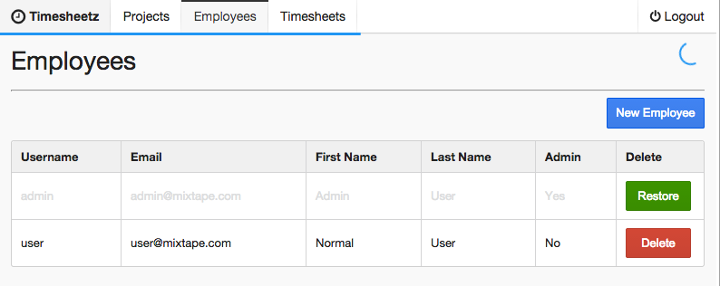

# Lab Six - Creating Custom Components

## Checkout the Lab Branch
- In a terminal:

```
git checkout lab-06-custom-components-start
git pull
```

If not running, start the `gulp watch:dev` and `gulp serve:dev` tasks.  Otherwise, restart the running tasks to pick up any changes in the lab-06-custom-components-start branch.

&nbsp;
## Check it out!

- In this Lab we are going to create two custom components:
  - A progress spinner for REST calls using NProgress
  - A "Snackbar" messenger service.

- The Flux stores and actions have already been implemented for us.  All we need to do is create the components.

&nbsp;
## Create the Snackbar Messenger Component

- Before we start, check out the **SnackbarStore** and **SnackbarActions** that have already been implemented for you.

- Open **client/src/components/common/snackbar.jsx**

- First, let's take care of the boilerplate to hook our component to our **Flux** classes and initial state.

```javascript
  store: SnackbarStore,

  getInitialState: function () {
    return {
      message: '',
      messageType: ''
    };
  },

  componentWillMount: function () {
    this.store.addChangeListener(this.notify);
  },

  componentWillUnmount: function () {
    this.store.removeChangeListener(this.notify);
  },

  notify: function () {
    this.setState(this.store.getState());
  },
```

- In our render method, we set **success**, **info**, or **error** classes on the snackbar according to the `messageType` on the component's state.
- It also adds a **hide** class if there is no message.  The easiest way to hide the snackbar is to remove the message from the component's state.
- Add the render method below:

```javascript
  render: function () {

    var classes = classNames('ui inline snackbar top right', {
      'hide':     !this.state.message.length,
      'success':  this.state.messageType === 'success',
      'info':     this.state.messageType === 'info',
      'error':    this.state.messageType === 'error'
    });

    return (
      <div className={classes}>
        <span className="title">{this.state.message}</span>
        <i className="fa fa-close" onClick={this.hide} />
      </div>
    )
  }
```

- Now, let's implement a `hide()` method to remove the message from our state and hide component.
  - It's just going to fire a `SnackbarAction.hide()`.

```javascript
  hide: function () {
    SnackbarActions.hide();
  },
```

&nbsp;
## Test the Snackbar

- Open **client/src/components/common/snackbar.spec.js** and add the suites. You know the drill by now.

```javascript
  describe('when there is no message', function () {

    beforeEach(function () {
      Snackbar = require('./snackbar');
      element = TestUtils.renderIntoDocument(<Snackbar />);
    });

    it('should hide the snackbar', function () {
      var div = TestUtils.findRenderedDOMComponentWithTag(element, 'div');
      expect(div.props.className).contains('hide');
    });
  });

  describe('with a success message', function () {
    beforeEach(function () {
      Snackbar = require('./snackbar');
      element = TestUtils.renderIntoDocument(<Snackbar />);
      element.setState({messageType: 'success', message: 'success'});
    });

    it('should reveal a success snackbar', function () {
      var div = TestUtils.findRenderedDOMComponentWithTag(element, 'div');
      expect(div.props.className).contains('success');
    });
  });

  describe('with an info message', function () {
    beforeEach(function () {
      Snackbar = require('./snackbar');
      element = TestUtils.renderIntoDocument(<Snackbar />);
      element.setState({messageType: 'info', message: 'info'});
    });

    it('should reveal an info snackbar', function () {
      var div = TestUtils.findRenderedDOMComponentWithTag(element, 'div');
      expect(div.props.className).contains('info');
    });
  });

  describe('with an error message', function () {
    beforeEach(function () {
      Snackbar = require('./snackbar');
      element = TestUtils.renderIntoDocument(<Snackbar />);
      element.setState({messageType: 'error', message: 'error'});
    });

    it('should reveal an error snackbar', function () {
      var div = TestUtils.findRenderedDOMComponentWithTag(element, 'div');
      expect(div.props.className).contains('error');
    });
  });

  describe('clicking the close icon', function () {
    beforeEach(function () {
      spies.hide = sinon.stub(SnackbarActions, 'hide');
      Snackbar = require('./snackbar');
      element = TestUtils.renderIntoDocument(<Snackbar />);
    });

    afterEach(function () {
      spies.hide.restore();
    });

    it('should hide the snackbar', function () {
      var icon = TestUtils.findRenderedDOMComponentWithTag(element, 'i');
      TestUtils.Simulate.click(icon);
      expect(spies.hide).to.have.been.called;
    });
  });
```

- Verify that all the tests pass before moving on to the next section.

&nbsp;
## Add the Snackbar to the App Component

- Open **client/src/components/app.jsx**

- First we need to inject our **Snackbar** into the **App** module:

```javascript
var Snackbar = require('./common/snackbar');
var SnackbarStore = require('../stores/snackbar.store');
```

- Inside the `render()` method, find the `TODO` and replace it with our new **Snackbar**

```javascript
 <Snackbar />
```

&nbsp;
## Run the application and see your work.

If you haven't already done so,
- In a terminal windows run: `gulp watch:dev` to fire off the build.
- In a separate terminal run: `gulp serve:dev` to serve the index.html.
- Navigate to [http://localhost:3000](http://localhost:3000) in your favorite browser.

- Try Deleting and Restoring an employee to see your Snackbar message.


&nbsp;
## Create a Progress Spinner

- We'll use the **axios** interceptors to start and stop the NProgress spinner.

- Open **client/src/util/progress.js**
- Add the following:

```
axios.interceptors.request.use(
  function (config) {
    NProgress.start();
    return config;
  },
  function (err) {
    NProgress.done();
    return Promise.reject(err);
  }
);

axios.interceptors.response.use(
  function (response) {
    NProgress.done();
    return response;
  },
  function (err) {
    NProgress.done();
    return Promise.reject(err);
  }
);
```

&nbsp;
## Register the Interceptors During Bootstrap

- Add the require to **client/src/main.jsx**:

```javascript
// Set up the axios interceptors
require('./util/progress')();
```

&nbsp;
## Run the application and see your work.

If you haven't already done so,
- In a terminal windows run: `gulp watch:dev` to fire off the build.
- In a separate terminal run: `gulp serve:dev` to serve the index.html.
- Navigate to [http://localhost:3000](http://localhost:3000) in your favorite browser.

- Try Deleting and Restoring employees, projects, or timesheets and watch for the spinner.
- Sweet!



&nbsp;
## Commit your changes to Git and celebrate. You have completed your final lab.

```
git add .
git commit -m 'We added some custom components'
```
